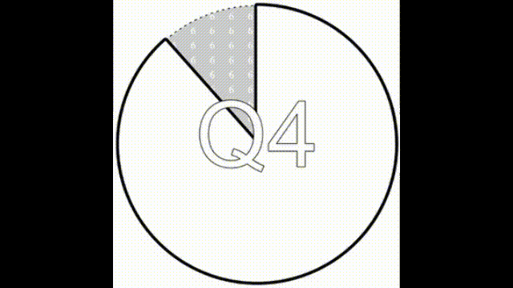

# Quarterly

"What Quarter is it?", and "How long do we have left?", [visualised as a clock](https://quarterly.houseofmoran.io/).

# Credits

The original idea for this came from [Brett Bunting][brett] back in August 2021. Further development and feedback came from the 🚀&nbsp;Hyperdrive team at Skyscanner, [Stuart Paton][stuart] in particular.

To some extent, [I](https://www.houseofmoran.com/) ignored [Brett's][brett] subsequent wishes, so I shall give him credit for all the positives, and I'll take any negatives 😊.

[brett]: https://www.linkedin.com/in/brettbunting/
[stuart]: https://www.linkedin.com/in/stuartjohnpaton/

# History

## Quick Hack

The original version was as quick a hack as possible, as it was written within a lunchtime break :-) .

It used a simple HTML Canvas for rendering, and made a bunch of assumptions. For example, that one quarter `==` 13 weeks.

## Rewrite

The next version was a rewrite in SVG and D3, so that various visual aspects could be tightly controlled.

From there a proper date library was added, a model/view separation enforced, and some tests of the model written.

The subtle-but-jarring difference between weeks and quarters was directly shown.

This was tweaked quite a few times to make some aspects clearer. A logo was added, via embedded FontAwesome icons.

## Preview

To allow Facebook/Twitter/Slack previews of this client-side app, the strategy from ["When backend is frontend, and back again"](https://www.houseofmoran.com/post/163952918683/when-backend-is-frontend-and-back-again) was applied.

This time, it was [a Rust service](./preview/src/bin/server.rs) running on `fly.io` which uses an embedded Chrome instance to take a screenshot of the main site and return it as an image. This is proxied through Netlify config so that it appears as [`preview.png`][preview].

[preview]: https://quarterly.houseofmoran.io/preview.png
